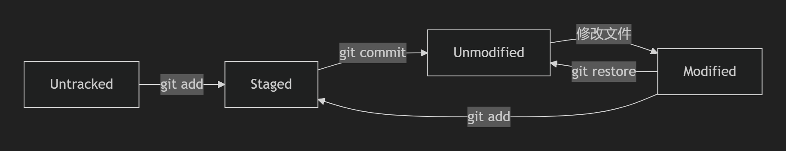

```
git init [name] # create a repo
git clone https://github.com/user/repo.git # create a repo from github

git status

git add <file>
git rm --cached <file>

git commit -m "my message"

git log [--oneline]

git reset [--soft|hard|mixed] <id> 
git reflog # 变更记录
git ls-files # 查看文件

git diff # 默认工作区与暂存区差异
# HEAD是版本库中的最新提交
git diff HEAD # 工作区vs版本库
git diff --cached #暂存区vs版本库
git diff <id1> <id2>
git diff HEAD~ HEAD # git diff HEAD^ HEAD 版本库上一版本vs当前版本
git diff HEAD~3 HEAD [filename]

git ls-files #查看所有已跟踪
git rm <file> # 从工作区和暂存区删除,不修改版本库（需commit）
git rm --cached <file> #删暂存区


git clone <repo>
git pull
git push

git remote add origin git@github.com:LyuZongqi/onehour.git
git remote add gitee git@xxxxx
git push -u origin main
git remote -v
git pull <远程仓库名> <远程分支名>:<本地分支名>
git push # git push gitee main


```